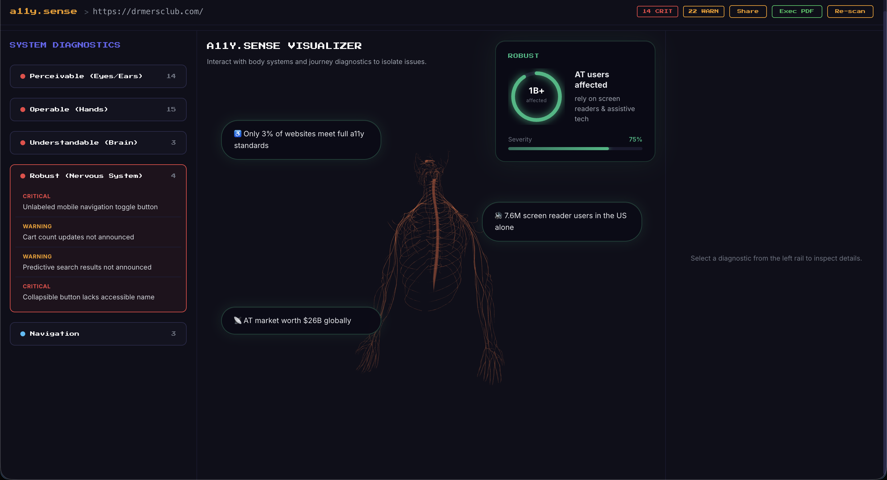

# a11y.sense


> *"Something like 99% of all websites have accessibility issues. Assume there's something wrong and you're probably right."*
> — Disabled Reddit user

**1.3 billion people live with a disability. Most of the web wasn't built for them. a11y.sense fixes that.**

---

## What is a11y.sense?

a11y.sense is an AI-powered accessibility QA sandbox that audits any live URL against the **Web Content Accessibility Guidelines (WCAG)** — and actually tells you how to fix what's broken.

Paste a URL. Get a full accessibility audit mapped to WCAG principles. See every issue visualized on an **interactive 3D human skeleton** where each body system represents a disability category. Click the brain for cognitive issues. Click the hands for motor issues. No jargon. No guesswork.

---

## The Visualizer


Every issue is mapped to the body system it affects. **Perceivable** lights up the skull and sensory anatomy. **Operable** targets the hands. **Understandable** hits the brain. **Robust** traces the nervous system. Click any body part to drill into the exact issues, the affected users, and the fix.



Each issue panel shows you:
- The **WCAG principle and success criterion** it violates
- **Who is affected** and how many people globally
- A plain-English **description** of why it matters
- A **suggested fix** with the exact CSS class or element to target
- The **raw affected HTML element** — ready to paste into your PR

---

## Developer Handoff


When you're done auditing, generate a **developer-ready `.md` report** per WCAG principle. Copy it straight into a GitHub issue or download it for your PR. Zero friction from audit to fix.

---

## Features

- **Live URL auditing** — paste any URL, get real results in seconds
- **5 parallel AI audit profiles** — running simultaneously across all WCAG core principles
- **WCAG-mapped issue reporting** — every issue tagged with the exact guideline it violates
- **Actionable fixes** — not just what's broken, but how to fix it with precise CSS selectors
- **Interactive 3D skeleton** — WCAG's four abstract principles made immediately human and intuitive
- **Gemini Vision screenshot analysis** — visual layer inspection on top of DOM auditing
- **Playwright-powered element resolution** — finds exact coordinates and selectors for every flagged element
- **Dev Handoff export** — one-click `.md` report per principle, ready for GitHub

---

## How It Works

```
Your URL
   │
   ▼
Playwright scrapes the live page → extracts DOM, screenshots, element coordinates
   │
   ▼
Gemini Flash runs 5 parallel audits across all WCAG profiles simultaneously
   │
   ▼
Structured JSON: issues, WCAG codes, CSS selectors, severity, fixes
   │
   ▼
3D skeleton maps each issue to the body system and disability it affects
   │
   ▼
You ship accessible code
```

---

## Tech Stack

| Layer | Tech |
|---|---|
| Frontend | Next.js + React 19 |
| 3D Visualization | Three.js |
| AI Auditing | Google Gemini Flash |
| Visual Analysis | Gemini Vision |
| Browser Automation | Playwright |

---

## WCAG Principles → Skeleton Mapping

| WCAG Principle | Body System | Linked Disabilities |
|---|---|---|
| **Perceivable** | Eyes / Ears / Skull | Visual, Auditory |
| **Operable** | Hands / Limbs | Motor |
| **Understandable** | Brain | Cognitive, Neurological |
| **Robust** | Nervous System | Assistive technology users |

---

## Why We Built This

The tools that exist today either overwhelm developers with raw WCAG text or produce surface-level reports with no path to a fix. Neither helps. We built a11y.sense because accessibility shouldn't require a specialist — it should be obvious, immediate, and baked into the workflow.

The Playwright → Gemini pipeline we built is genuinely different. It doesn't just scan static HTML. It loads the page, resolves elements in context, and audits what a real user actually encounters. Only 3% of websites meet full a11y standards. That number should be embarrassing. We're here to change it.

---

## What We Learned

Building a11y.sense gave us a deep appreciation for the craft of AI prompt engineering. Getting Gemini to return consistent, structured JSON across five parallel audit profiles taught us that the difference between a useful AI output and an unusable one often comes down to how precisely you constrain the prompt. We also came face-to-face with just how pervasive accessibility gaps are in the real world — auditing live URLs made it viscerally clear that accessibility is still treated as an afterthought by the vast majority of developers, reinforcing why tools like a11y.sense genuinely matter.

---

## What's Next

- **Mobile app accessibility** — bringing WCAG-mapped auditing to iOS and Android
- **IDE plugin + CI/CD integration** — catch accessibility issues at commit, not after deploy

---

## Built By

| | GitHub | LinkedIn |
|---|---|---|
| **Ebad Ahmad** | [github.com/ebad66](https://github.com/ebad66) | [linkedin.com/in/ebadahmad](https://linkedin.com/in/ebadahmad) |
| **Aayan Atif** | [github.com/aayanA6](https://github.com/aayanA6) | [linkedin.com/in/aayanatif](https://linkedin.com/in/aayanatif) |
| **Shayan Syed** | [github.com/Shay350](https://github.com/Shay350) | [linkedin.com/in/shayansyed1](https://linkedin.com/in/shayansyed1) |


Made with conviction at **GenAIGenesis**.

---

## License

MIT
